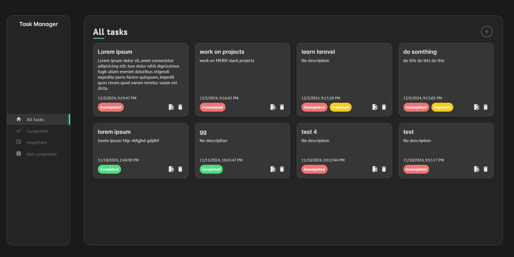
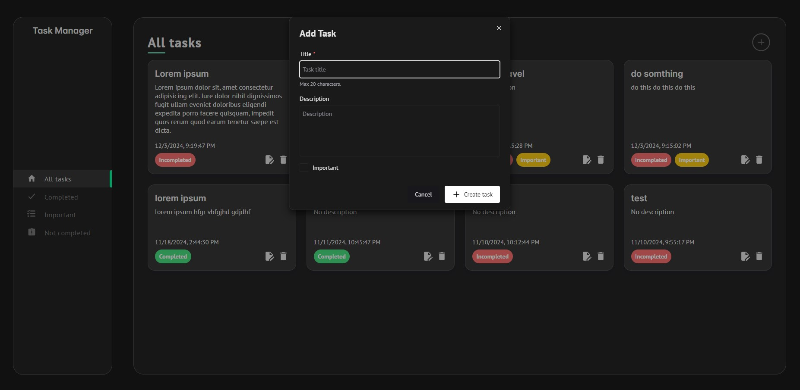
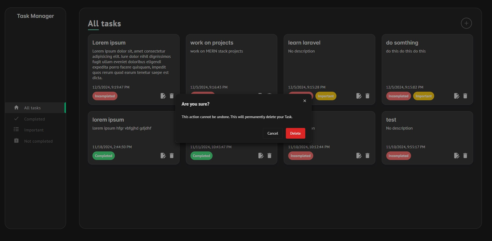

# Task Manager

A modern Task Manager application for practicing CRUD with MERN stack. This application allows users to efficiently manage their tasks by providing features like task creation, editing, deletion, filtering, and sorting.

## Features

- Add, edit, and delete tasks.
- Filter tasks by completion and importance.
- Real-time updates using context management.
- Persistent data storage with MongoDB.
- Error handling with user-friendly toast notifications.

## Technologies Used

### Frontend

- **React**
- **Chakra UI**
- **TypeScript**

### Backend

- **Node.js**
- **Express**
- **MongoDB**

## Screenshots

### Task List View



### Add Task




### Delete Task



## Installation

1. Clone this repository:

   ```bash
   git clone https://github.com/your-username/task-manager.git
   cd task-manager
   ```

2. Install dependencies:

   ```bash
   npm install
   ```

3. Set up your backend server:

   - Create a `.env` file in the root directory of the server folder with the following variables:
     ```env
     MONGODB_URI=your-mongodb-connection-string
     PORT=
     API_PREFIX=
     CLIENT_URL=
     ```
   - Start the backend server:
     ```bash
     cd server
     npm run dev
     ```

4. Run the frontend development server:
   ```bash
   cd client
   npm run dev
   ```

## API Endpoints

### Task Routes

- `GET /api/v1/tasks`: Retrieve all tasks
- `POST /api/v1/tasks`: Add a new task.
- `PATCH /api/v1/tasks/:id`: Edit an existing task.
- `DELETE /api/v1/tasks/:id`: Delete a task.

## Future Enhancements

- Add user authentication for personalized task management.
- Task categorization with tags or labels.

---

### Contributing

Contributions are welcome! Please fork the repository, make your changes, and submit a pull request.
